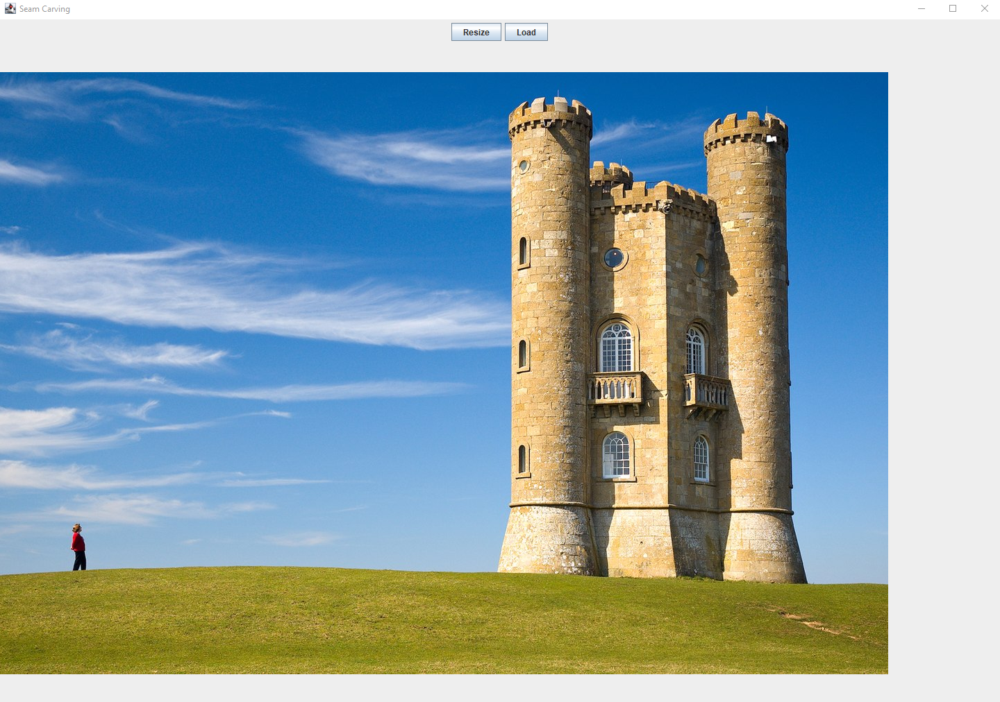

# Seam Carving
[Seam Carving Wikipedia Page](https://en.wikipedia.org/wiki/Seam_carving)
#### Seam Carving is a content-aware image resizing algorithm that resizes images without losing meaningful content. 
#### This is accomplished by removing what we call "low energy seams". Low energy seams are a horizontal or vertical set of pixels in the image that are determined to hold the least importance to the image.  

The following steps are taken to accomplish seam removal:
1. A 2D energy map of values is created with each energy corresponding to a pixel. The energy is determined by calculating the contrast in color values with its neighboring pixels.
2. The lowest energy seam is determined by calculating the horizontal or vertical path with the lowest cumulative energy value.
3. The pixels that correspond to the lowest energy seam are removed. 
4. This is repeated for the horizontal and vertical seams until the new image dimensions are reached.

#### Original image:

#### Original image with adjusted dimensions: 

#### Image after resizing:
